# AutoPilot DevOps
### Multi-Agent Code Intelligence & DevOps Automation System
**Kaggle × Google Agents Intensive 2025 Capstone**  


[](https://www.kaggle.com/competitions/agents-intensive-capstone-project)
[](https://aviral-dev.vercel.app/)

      

> **AutoPilot DevOps is a production-ready, safety-first multi-agent system for code intelligence, log analysis, and DevOps automation.**  
> **Fully transparent, read-only analysis with defense-in-depth safety architecture.**

</div>

---

## System Architecture

```mermaid
graph TD
    User((User)) --> Orchestrator[Main Orchestrator]
    subgraph Cognitive_Core ["Cognitive Core"]
        Orchestrator --> Planner[Planner Agent<br/>Task Routing • Request Analysis]
        Planner --> Worker[Worker Agent<br/>Code Analysis • Tool Execution]
        Worker --> Evaluator[Evaluator Agent<br/>Safety Guardrail]
        Evaluator -->|APPROVED| User
        Evaluator -->|REJECTED| Refusal[Safe Refusal]
    end
    subgraph Memory ["Memory System"]
        LTM[(Long-Term Memory<br/>devops_preferences.json)]
        STM[(Short-Term Context<br/>Last 8 turns)]
    end
    subgraph Observability ["Live Observability Panel"]
        Logs[Live Logs + Agent Monologue]
        Graph[Real-time Code Metrics Graph]
        Health[Live Code Health Dashboard]
    end
    Orchestrator -->|Read/Write| LTM
    Orchestrator -->|Context| STM
    Orchestrator -->|Live Update| Logs
    Orchestrator -->|Live Update| Graph
    Orchestrator -->|Live Update| Health
    Worker --> Tools[Tools<br/>File Reading • Dependency Analysis • Log Parsing]
    style Cognitive_Core fill:#1e293b,stroke:#818cf8,stroke-width:4px,color:white
    style Memory fill:#0f172a,stroke:#a78bfa,stroke-dasharray: 5 5
    style Observability fill:#0f172a,stroke:#f472b6,stroke-dasharray: 5 5
```




---

## Key Features

### 1. Repository Intelligence
- **Codebase Analysis**: Read entire repository structure
- **Dependency Graphs**: Build dependency relationships between modules (with visual graph)
- **Complexity Analysis**: Calculate cyclomatic complexity for functions
- **Dead Code Detection**: Identify potentially unused functions and imports
- **Duplicate Code Detection**: Find identical or similar code blocks across files
- **Architecture Overview**: Generate comprehensive architecture documentation
- **Complexity Heatmap**: Visual representation of high-complexity modules

### 2. Incident Commander
- **Log Parsing**: Parse and analyze log files
- **Error Clustering**: Group similar errors by pattern
- **Anomaly Detection**: Detect spikes and unusual patterns
- **Root Cause Analysis**: Identify underlying issues
- **Postmortem Generation**: Create structured incident summaries
- **Error Timeline**: Visual timeline of errors and warnings over time

### 3. Migration & Refactoring Assistant
- **Framework Detection**: Identify outdated frameworks and libraries
- **Migration Planning**: Generate step-by-step migration plans with breaking changes
- **Code Transformation**: Suggest safe refactoring improvements
- **Breaking Changes**: Identify potential breaking changes
- **Text-Only Diffs**: Provide safe code suggestions (no execution)
- **Refactoring Suggestions**: File-by-file improvement recommendations

### 4. Triple-Layer Safety System

1. **Layer 1: Planner** (Destructive Operation Detection)
   - Pre-checks for file deletion, system modification, execution commands
   - Routes unsafe requests to boundary enforcement

2. **Layer 2: Worker** (Read-Only Operations)
   - Strict read-only file operations
   - Text-based code suggestions only
   - No shell command execution

3. **Layer 3: Evaluator** (Final Guardrail)
   - Regex-based banned phrase detection (rm -rf, DELETE, DROP TABLE, etc.)
   - LLM-based contextual safety check
   - Sanitized fallback responses

---

## Technology Stack

### Dependencies
- `google-genai`: Google Gemini API client
- `python-dotenv`: Environment variable management
- `gradio`: Web UI framework (Material Design styling)
- `loguru`: Advanced logging
- `matplotlib`: Chart generation for code metrics
- `pillow`: Image processing
- `networkx`: Dependency graph visualization
- `seaborn`: Statistical data visualization
- `watchdog`: File watching for auto-reload
- `pytest`: Testing framework
- `requests`: HTTP requests for GitHub API

### AI Models
- **Primary Model**: Gemini 2.0 Flash Exp
- **Usage**: All three agents use Gemini for analysis and generation
- **Key Rotation**: Automatic API key rotation for reliability

---

## Quick Start

### 1. Install Dependencies
```bash
pip install -r requirements.txt
```

### 2. Configure Environment
Create a `.env` file:
```env
GEMINI_API_KEYS=your_api_key_1,your_api_key_2
MODEL_NAME=gemini-2.0-flash-exp
TEMPERATURE=0.1
MAX_OUTPUT_TOKENS=2048
GITHUB_TOKEN=ghp_xxxxxxxxxxxx  # Optional, for private repos
```

### 3. Run the Application

**Standard Mode:**
```bash
python app.py
```

**Development Mode (Auto-Reload):**
```bash
python dev.py
```

The application will be available at `http://127.0.0.1:7860`

**Note:** Development mode automatically restarts the app when you make code changes, similar to nodemon for Node.js.

### 5. Deploy to Production

**Quick Deploy (5 minutes):**
```bash
# Run deployment helper
python deploy_hf.py

# Follow the on-screen instructions to deploy to Hugging Face Spaces
```

**See [QUICK_DEPLOY.md](QUICK_DEPLOY.md) for step-by-step deployment guide.**

### 4. Run Tests
```bash
# Run all tests
python tests/run_all_tests.py

# Run with coverage
python tests/run_with_coverage.py

# Run specific test file
pytest tests/test_tools.py -v
```

**Test Results:** ✅ 72/72 tests passing (100% coverage of all components)

### 5. Documentation
- **[Complete Documentation](docs/README.md)** - Full API reference and guides
- **[GitHub Integration Guide](GITHUB_INTEGRATION.md)** - How to analyze GitHub repositories
- **[Test Suite Documentation](tests/README.md)** - Testing guide and coverage

---

## Usage Examples

### Repository Analysis
```
"Analyze this repository"
"Generate architecture documentation"
"Find tech debt in the codebase"
```

### Incident Analysis
```
"Explain logs in sereneshield.log"
"Analyze errors in logs/error.log"
"Identify root cause from incident.log"
```

### Migration & Refactoring
```
"Suggest migration from Flask to FastAPI"
"Refactor the main_agent.py file"
"Generate migration plan for Django to FastAPI"
```

### Code Intelligence
```
"Calculate complexity for project/agents/"
"Build dependency graph"
"Detect dead code"
```

---

## Project Structure

```
kaggle-capstone-ai-agent-main/
├── app.py                          # Main Gradio UI application
├── dev.py                          # Auto-reload development server
├── requirements.txt                # Python dependencies
├── README.md                       # This file
├── docs/
│   └── README.md                   # Complete documentation
├── tests/
│   ├── test_tools.py               # Tools tests (15 tests)
│   ├── test_github_tools.py        # GitHub tools tests (6 tests)
│   ├── test_visualizations.py     # Visualization tests (6 tests)
│   ├── test_agents.py              # Agent tests (10 tests)
│   ├── test_memory.py              # Memory tests (11 tests)
│   ├── test_main_agent.py          # Main agent tests (7 tests)
│   ├── test_integration.py         # Integration tests (6 tests)
│   ├── test_a2a_protocol.py        # Protocol tests (3 tests)
│   ├── test_config.py              # Config tests (6 tests)
│   └── run_all_tests.py            # Test runner
├── project/
│   ├── config.py                   # Configuration and API key management
│   ├── main_agent.py               # Main orchestrator agent
│   ├── agents/
│   │   ├── planner.py              # Planner agent (task routing)
│   │   ├── worker.py               # Worker agent (code analysis)
│   │   └── evaluator.py            # Evaluator agent (safety guardrail)
│   ├── core/
│   │   ├── a2a_protocol.py         # Agent-to-Agent typed protocol
│   │   ├── context_engineering.py # System prompts for agents
│   │   ├── gemini_client.py       # Gemini API client
│   │   └── observability.py       # Logging system
│   ├── memory/
│   │   ├── session_memory.py       # Short-term conversation history
│   │   └── long_term_memory.py    # Persistent preferences
│   └── tools/
│       ├── tools.py                # Code intelligence tools (14 tools)
│       ├── github_tools.py         # GitHub integration (6 tools)
│       └── visualizations.py      # Visualization tools (3 tools)
└── assets/
    └── images/
        └── screenshot.png
```

---

## Safety Features

### Banned Operations
The system automatically blocks:
- File deletion commands (`rm -rf`, `delete`)
- Database operations (`DROP TABLE`, `TRUNCATE`)
- System modifications (`sudo`, `systemctl`, `chmod 777`)
- Execution commands (`subprocess`, `os.system`, `eval`)
- Kubernetes destructive operations (`kubectl delete`)

### Allowed Operations
- Read-only file access
- Code analysis and static analysis
- Documentation generation (Markdown)
- Text-based code suggestions (diffs)
- Log parsing and analysis
- Dependency graph generation
- Complexity calculations

---

## Kaggle × Google Agents Intensive Requirements

✅ **Multi-Agent System**: 3 specialized agents (Planner, Worker, Evaluator)  
✅ **Typed A2A Protocol**: Structured communication via dataclasses  
✅ **Tools**: Code intelligence tools (file reading, dependency analysis, log parsing)  
✅ **Session Memory**: Last 8 turns maintained  
✅ **Long-Term Memory**: Persistent JSON storage  
✅ **Observability**: Live logs and charts  
✅ **Dedicated Evaluator Agent**: Final safety guardrail  
✅ **Context Engineering**: System prompts for each agent  
✅ **Gemini 2.0 Flash**: Primary AI model  
✅ **Public Deployment**: Hugging Face Spaces ready  

---

## Complete Feature List

### ✅ Implemented Features

**Multi-Agent System:**
- ✅ Planner Agent (task routing & analysis)
- ✅ Worker Agent (code analysis & tool execution)
- ✅ Evaluator Agent (safety guardrail)
- ✅ Main Orchestrator (pipeline coordination)

**Tools & Utilities (20+ tools):**
- ✅ File reading & directory traversal
- ✅ Import extraction & dependency graphs
- ✅ Complexity calculation
- ✅ Dead code detection
- ✅ Duplicate code detection
- ✅ Outdated library detection
- ✅ Log parsing & error clustering
- ✅ Anomaly detection
- ✅ Migration planning
- ✅ Postmortem generation
- ✅ Markdown documentation generation
- ✅ GitHub repository cloning & management

**Visualizations:**
- ✅ Dependency graph visualization
- ✅ Complexity heatmap
- ✅ Error timeline plotting
- ✅ Code metrics trend chart

**Memory Systems:**
- ✅ Session memory (8 turns)
- ✅ Long-term memory (JSON persistence)
- ✅ Preference learning

**UI Features:**
- ✅ Material Design interface (Vercel-style)
- ✅ 11 dashboard tabs
- ✅ Real-time observability
- ✅ GitHub integration
- ✅ Auto-reload development server

**Testing:**
- ✅ 72 comprehensive tests
- ✅ 100% component coverage
- ✅ Integration tests
- ✅ Mock mode for fast testing

## Future Roadmap

- [ ] Vector database for scalable code search
- [ ] Multi-language support (JavaScript, Go, Rust, etc.)
- [ ] CI/CD integration
- [ ] Automated test generation
- [ ] Performance profiling integration
- [ ] Security vulnerability scanning
- [ ] Code review automation
- [ ] Real-time collaboration features

---

## Documentation

- **[📚 Complete Documentation](docs/README.md)** - Full API reference, architecture details, and guides
- **[🚀 Deployment Guide](DEPLOYMENT.md)** - Deploy to Hugging Face Spaces and Vercel
- **[⚡ Quick Deploy Guide](README_HF_SPACES.md)** - 5-minute deployment to Hugging Face
- **[🔗 GitHub Integration Guide](GITHUB_INTEGRATION.md)** - How to analyze public and private repositories
- **[🧪 Test Suite Documentation](tests/README.md)** - Testing guide, coverage, and examples
- **[⚡ Quick Start Guide](QUICKSTART.md)** - Get started in 5 minutes

## Contributing

This project was transformed from a mental health companion to a DevOps intelligence system as a demonstration of multi-agent architecture flexibility.

### Development Workflow

1. Fork the repository
2. Create a feature branch
3. Make your changes
4. Write/update tests
5. Run test suite: `python tests/run_all_tests.py`
6. Submit a pull request

### Code Standards

- Follow PEP 8 style guide
- Use type hints for all functions
- Document all public APIs
- Write tests for new features
- Maintain test coverage above 90%

---

## License

This project is part of the Kaggle × Google Agents Intensive 2025 Capstone.

---

**Built with ❤️ using Multi-Agent Architecture**
